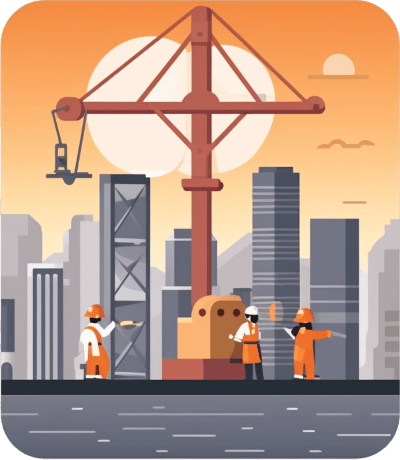

<code>prompt: group of software engineers sitting on the rooftop, pair programming, hong kong, neon light, night, top-view --ar 256:65 --c 10</code>

# Software Builders’ Night

<code>prompt: squared with round edges mobile app logo design, flat vector app icon of programmers using crane to build hong kong, minimalistic, dull color, white background --ar 1:1 --c 10</code>

This event will be conducted in English.

### Our Vision

Connect software engineering professionals to foster mutual growth.

### Why?

We believe building a good software will satisfy your users, and drive your career to success.

However, the definition of "good" grows / expands over time.

To continuously stay with "good", we want to foster the bonding between engineers in Hong Kong 
to continuously exchange their engineering experience across domains and companies.

### The Mutual Growth

We strongly believe having mutual benefits between the organizers, speakers, and audiences is 
the only way to sustain the community.

#### Speakers

- Receive feedbacks from your audience to improve your presentation skills.
- Get the source of motivation to dive deeper and consolidate related knowledges into a lightning 
presentation.
- Grow your reputation in the software engineering industry.
- Connect more passionate professionals who share the same vision.

#### Audience

- Learn from the presentations shared by the speakers, i.e. the design process, 
thought leadership, problem solving techniques, etc.
- Get more software engineering directions to dive deep and avoid pitfalls
- Converge the learning and create positive impacts in your organization
- Connect more passionate professionals who share the same vision.

### Becoming a Speaker

We are happy to grow the speaker force. 

Please submit an issue with your interested topic and profile on our GitHub.
